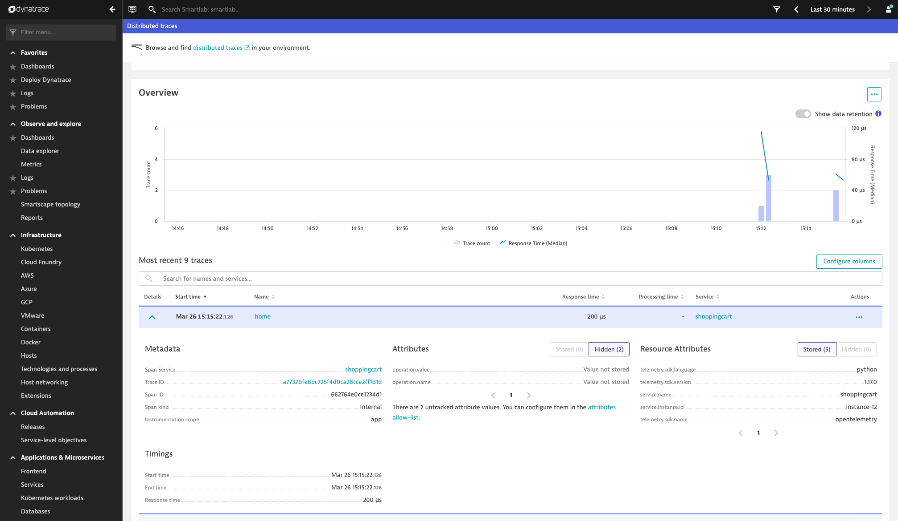
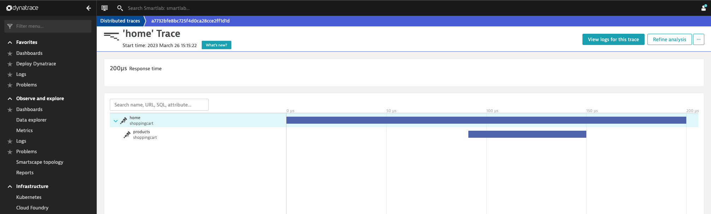

# Configure OpenTelemetry to export to Dynatrace

In the last step the OpenTelemetry SDK was configured to log all spans to the local console.
This step will show how to add an OLTP span exporter alongside the console exporter to send all
our spans to a central telemetry and analysis backend.
In this course a Dynatrace OLTP exporter will be used. The same method can be used for any other
telemetry backend provider you are using.

To decouple the configuration of the telemetry backend receiver from your application implementation,
environment variables should be used to configure the URL as well as the authorization headers.
In that way, you can flexibly set and change the receiver of the OpenTelemetry information during the
deployment of your application without the need to change the applications instrumentation code.

Use the environment variables 'OTEL_EXPORTER_OTLP_TRACES_ENDPOINT' and 'OTEL_EXPORTER_OTLP_TRACES_HEADERS' to define where the spans should be sent to.
See an example below that shows how to set a Dynatrace environment on Linux to receive the OpenTelemetry spans:

```bash
export OTEL_EXPORTER_OTLP_TRACES_ENDPOINT=https://<YOUR_DYNATRACE_ID>.live.dynatrace.com/api/v2/otlp/v1/traces
export OTEL_EXPORTER_OTLP_TRACES_HEADERS="Authorization=Api-Token%20<YOUR_DYNATRACE_API_TOKEN>"
```

See an example below that shows how to set a Dynatrace environment on Windows to receive the OpenTelemetry spans:

```bash
set OTEL_EXPORTER_OTLP_TRACES_ENDPOINT=https://<YOUR_DYNATRACE_ID>.live.dynatrace.com/api/v2/otlp/v1/traces
set OTEL_EXPORTER_OTLP_TRACES_HEADERS="Authorization=Api-Token%20<YOUR_DYNATRACE_API_TOKEN>"
```

The instrumentation code of the Flask application has been modified to not only send the spans to the local
console but also to a OLTP span exporter.

Be aware that the value of the headers environment variable in OTEL_EXPORTER_OTLP_TRACES_HEADERS needs to be URL encoded, which means that the space character between Api-Token and the secret needs to be replaces with '%20'!

```python
from flask import Flask
import json
import os

# Those two environment variables must be present
if 'OTEL_EXPORTER_OTLP_TRACES_ENDPOINT' not in os.environ:
    print("Environment variable OTEL_EXPORTER_OTLP_TRACES_ENDPOINT is missing!")
    
if 'OTEL_EXPORTER_OTLP_TRACES_HEADERS' not in os.environ:
    print("Environment variable OTEL_EXPORTER_OTLP_TRACES_HEADERS is missing!")

from opentelemetry.exporter.otlp.proto.http.trace_exporter import (
    OTLPSpanExporter,
)

from opentelemetry import trace
from opentelemetry.sdk.trace import TracerProvider
from opentelemetry.sdk.trace.export import (
    BatchSpanProcessor,
    ConsoleSpanExporter
)

from opentelemetry.sdk.resources import Resource

trace_provider = TracerProvider(resource=Resource.create({
            "service.name": "shoppingcart",
            "service.instance.id": "instance-12",
        }),)

# Sets the global default tracer provider
trace.set_tracer_provider(trace_provider)

# Creates a tracer from the global tracer provider
tracer = trace.get_tracer(__name__)

# Processor for console export
processor = BatchSpanProcessor(ConsoleSpanExporter())
trace_provider.add_span_processor(processor)

# Processor for OTLP span export to Dynatrace or any other receiver
span_exporter = OTLPSpanExporter()

span_processor = BatchSpanProcessor(span_exporter)
trace_provider.add_span_processor(span_processor)

app = Flask(__name__)

@app.route('/')
def home():
    with tracer.start_as_current_span("home") as span:
        span.set_attribute("operation.value", 1)
        span.set_attribute("operation.name", "home")
        ret = { 
            'path' : 'home'    
        }
        # now call an internal service method
        products()
        # then return
        return json.dumps(ret)

def products():
    # add this span as child into the current trace
    with tracer.start_as_current_span("products") as child:
        child.set_attribute("operation.product.count.value", 99)
        child.set_attribute("operation.name", "products")
        ret = { 
            'path' : 'products'    
        }
        return json.dumps(ret)
```

Within your configured Dynatrace environment you should now receive all traces as it is shown within the screenshots below.



