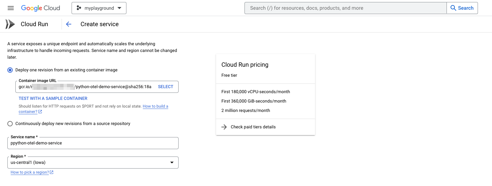

# Deploy and run the service in Google Cloud

The Flusk Docker image is now registered in the Docker repository of your Google Cloud project. In order to deploy the Flusk app and to send telemetry data to an OpenTelemetry endpoint this step will use Google Cloud Run to instantiate a service.

Open your Google project within Google Cloud and navigate to Cloud Run. Create a new service and select your Flusk app Docker image from the projects Docker registry, as it is shown below:



Under the service's container configuration tab, set the container port to 5000 and add the two environment variables for redirecting the OpenTelemetry receiver:

```bash
OTEL_EXPORTER_OTLP_TRACES_ENDPOINT=https://<YOUR_DYNATRACE_ID>.live.dynatrace.com/api/v2/otlp/v1/traces
OTEL_EXPORTER_OTLP_TRACES_HEADERS="Authorization=Api-Token%20<YOUR_DYNATRACE_API_TOKEN>"
```

Once the newly created service is up and running in Google Cloud Run, you can access the service through the service endpoint and you will see the OpenTelemetry console export within the services logs tab, as shown below:


Within your configured Dynatrace environment you should now also receive the traces as the two Dynatrace screenshots show below.


